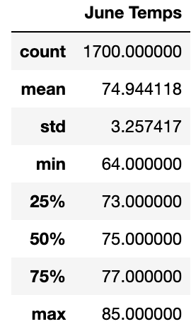
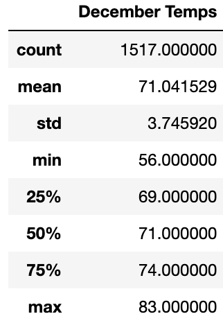

# Surf Shop Temperature Analysis

## Overview

The purpose of this analysis is to use the dataset of temperatures on the island of Oahu gathered over several years to determine if opening a surf shop on the island would be a viable year-round business. This particular dataset has been analyzed across all the years the data was gathered in the months of June and December, the former representing the beginning of the summer season, and the latter the beginning of the winter season, to see if these two months that live at both extremes of the expected weather cycle could support a surf shop.

## Results

The data seems to mostly suggest that a surf shop could be viable year-round on Oahu, with a couple of possible exceptions, as the tables below will show.

-The mean temperatures seen across both months are very similar, with June seeing a mean temperature of around 74 degrees and December seeing a mean temperature of around 71 degrees, for a difference of 3 degrees, a difference most climates would be jealous of! While the average temperature is undeniably lower in December than in June, the difference being this small points to the viability of a surf shop across both the summer season and the winter season.

-If you look at the quadrant data across both tables, you'll see that the dividers for each quartile of the two datasets are separated by a value of 3 to 4 degrees. For example, the midpoint of the June data falls at 75 degrees, meaning half of the temperatures recorded were above 75 degrees, and half were under, approximately. For December, that midpoint is at 71 degrees, a difference of 4 degrees, which is not insignificant, but not large enough to suggest that surfing would become impossible in the winter months.

-More concerning is the minimum temperature recorded in both datasets. For June the lowest recorded temperature was 64 degrees, which is significantly lower than our average, but not cold enough that it would suggest there would be a possibility that surfing would be impossible in this time frame. In the December dataset, however, the lowest recorded temperature was 56 degrees, which is still probably not cold enough to deter all brave souls from going surfing, but is low enough that it could give a potential surf shop owner pause. Luckily this is the minimum, and the average temperatures suggest that this would not be enough of a common occurence to be a huge mark against this business model, especially with the datapoint that tells us only a quarter of the recorded data fell under 69 degrees, even in one of the coldest months of the year.

## Summary

As discussed in the Results section of this analysis, the data indicates that the weather on Oahu would be cooperative for an individual looking to open a surf shop and operate it year-round. If there are still any doubts as to this business model, additional analysis could be performed on the December dataset to see how many days see temperatures that approach that minimum, say by falling under 60 degrees, because even with us knowing that only a quarter of the data points fall under 69 degrees, if it was not uncommon for the temperature to drop into the 50s, that could be cause for concern. It would also be wise to look at the data for both months to find the mode of the datasets, as seeing which temperature is most common would be helpful for providing a better picture of what the weather looks like on Oahu on a day-to-day basis.
